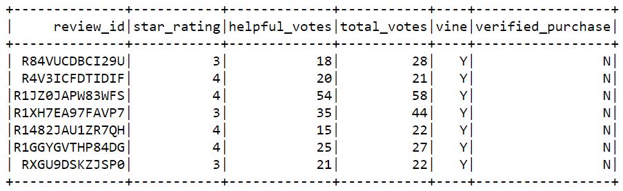

# Amazon_Vine_Analysis

## Purpose
The purpose of this project was to analyze Amazon Music reviews written by members of the paid Amazon Vine program. The objectives were:
- Use PySpark to perform the ETL process to extract the dataset, transform the data, connect to an AWS RDS instance, and load the transformed data into pgAdmin. 
- Use PySpark, Pandas, or SQL to determine if there is any bias toward favorable reviews from Vine members in the dataset.

## Resources
- Data Source: [Amazon Music Reviews](https://s3.amazonaws.com/amazon-reviews-pds/tsv/amazon_reviews_us_Music_v1_00.tsv.gz)
- Software: Google Colaboratory; Spark version 3.1.1; pgAdmin 4 version 4.29

## Results
### How many Vine reviews and non-Vine reviews were there?
Total Number of Vine Reviews: <b>7</b>
 
Total Number of non-Vine Reviews: <b>105,979</b>

### How many Vine reviews were 5 stars? How many non-Vine reviews were 5 stars?
Number of Vine 5-star Reviews: <b>0</b>
 
Number of non-Vine 5-star Reviews: <b>67,580</b>

### What percentage of Vine reviews were 5 stars? What percentage of non-Vine reviews were 5 stars?
Percentage of Vine 5-star reviews: <b>0</b>
 
Percentage of non-Vine 5-star reviews: <b>63.8%</b>

## Summary
Based on the results of this analysis, there is no positivity bias for reviews in the Vine program. Zero percent of all Vine music reviews were a 5-star rating, while 63.8% of the non-Vine reviews received a 5-star rating. Although there appears to be no bias in favor of Vine reviews, the results of this analysis are not realiable, as only 7 of the reviews were from Vine subscribers (Table 1) versus 67,580 non-Vine users (Table 2). More data needs to be collected for further analysis. Instead of excluding total vote counts that are less than 20 and only including "helpful_votes divided by total_votes that is equal to or greater than 50%," <b>ALL</b> votes should be included in the analysis, helpful or not. This may produce more Vine reviews to explore, yielding a more accurate conclusion.
 
#### Table 1: Vine Reviews

#### Table 2: Non-Vine Reviews

